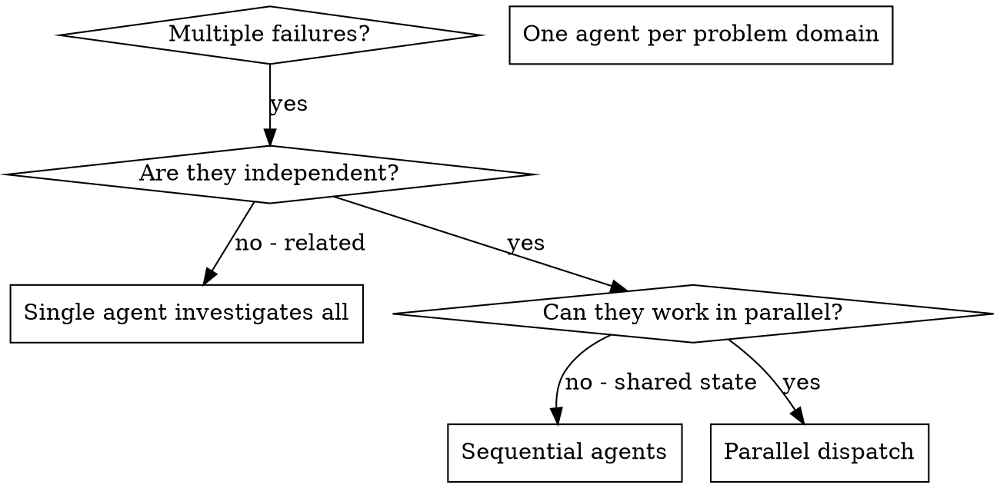

# Dispatching Parallel Agents

## Overview

You delegate tasks to specialized agents with isolated context. By precisely crafting their instructions and context, you ensure they stay focused and succeed at their task. They should never inherit your session's context or history — you construct exactly what they need. This also preserves your own context for coordination work.

When you have multiple unrelated failures (different test files, different subsystems, different bugs), investigating them sequentially wastes time. Each investigation is independent and can happen in parallel.

**Core principle:** Dispatch one agent per independent problem domain. Let them work concurrently.

## When to Use



**Use when:**
- 3+ test files failing with different root causes
- Multiple subsystems broken independently
- Each problem can be understood without context from others
- No shared state between investigations

**Don't use when:**
- Failures are related (fix one might fix others)
- Need to understand full system state
- Agents would interfere with each other

## Manual Task dispatch vs Workflow tool

Everything above describes **manual Task dispatch**: you hand-craft each agent's
prompt and integrate results yourself. This is the default and **it is NOT wrong** —
it is the right tool for most parallel work. Claude Code also ships a built-in
**Workflow tool** (`parallel()` / `pipeline()`) that orchestrates agents for you.
This section is an educational primer on *when* Workflow helps versus *when* it
over-engineers a job that manual dispatch already does well. It mandates nothing.

| Dimension | Manual Task dispatch (default) | Workflow tool (`parallel()` / `pipeline()`) |
|-----------|--------------------------------|---------------------------------------------|
| Problem shape | Heterogeneous problems — each agent does something different | Homogeneous domain — same operation fanned across many inputs |
| Result shape | Uncertain / free-form summaries you read and reconcile | High-confidence, predictable result schema you can consume programmatically |
| Human input mid-flow | Flow may need a human interruption or course-correction partway | No mid-flow human input — fire, collect, done |
| Integration | You judge and merge results case by case | Mechanical aggregation of uniform outputs |

**Rule of thumb:** if you would write three *different* agent prompts and then
*think* about how to combine the answers, stay manual. If you would write the *same*
prompt N times over uniform inputs and expect uniform structured results with no
human checkpoint, Workflow may remove boilerplate. When unsure, manual dispatch is
the safe default — do not reach for Workflow just because it exists.

**Opt-in Workflow patterns (future options, not requirements):**
- **Plan review as parallel + verify:** fan one plan out to several reviewer agents
  with a shared rubric (`parallel()`), then a final verify step aggregates findings.
- **Homogeneous batch fix:** apply the identical fix recipe across many independent
  files where each result is "patched / not patched" with the same shape.

**Shipped examples (real deterministic Workflows):** the plan skills ship two
parameterized scripts you can read as concrete references —
`superpowers:reviewing-plans/review-plan.workflow.js` (homogeneous parallel reviewers
over a shared rubric + adversarial verify) and
`superpowers:writing-plans/write-plan.workflow.js` (a scout → author → review pipeline).

Both are experiments to prototype on a single real workload before treating Workflow
as anything more than an occasional opt-in.

### Liveness monitoring

For long-running or Tier-1 dispatches, apply the liveness doctrine — see
`../../docs/liveness-doctrine.md`. (Terse pointer; the constants, signals, and
`state.json` shapes live there and in `superpowers:phase-handoff`, not here.)

**Promotion rule (at dispatch).** A dispatched unit is *promoted* to
`run_in_background` + liveness monitoring when it is **Tier-1** OR its budgeted
`deadline_s` exceeds the promotion threshold; otherwise it stays **synchronous**,
with the passive wall-clock floor as its backstop. Reference only — thresholds and
field shapes belong to the doctrine and `superpowers:phase-handoff`.

**Background vs synchronous.** Promoted units run in the background and are actively
monitored for liveness; the rest run synchronously and rely on the passive floor,
which is checked at the next task boundary and on resume.

**Batch-level Workflow mitigation.** A *dead* inner agent inside a `parallel()` /
`pipeline()` Workflow already surfaces as `null` to the aggregator (handled). A
*stuck* inner agent would otherwise wedge the batch invisibly, since Workflow owns
the fan-out and the orchestrator holds no per-agent record. So before invoking a
`parallel()` / `pipeline()` Workflow, the orchestrator stamps **one `inflight` entry
for the Workflow call itself** (`kind: "bg-agent"`, with `deadline_s` = the **sum**
of the inner per-agent budgets for a serial `pipeline()`, or the **max** for a
concurrent `parallel()`). The wall-clock floor then catches a wedged batch **as a
unit**.

**Residual limitation (narrowed).** This detects *that* a batch is stuck but not
*which* inner agent hung; restart is at batch granularity. Where per-agent recovery
matters, prefer manual `Task` dispatch (per-agent `inflight`, fully covered by the
doctrine) over a Workflow.

## The Pattern

### 1. Identify Independent Domains

Group failures by what's broken:
- File A tests: Tool approval flow
- File B tests: Batch completion behavior
- File C tests: Abort functionality

Each domain is independent - fixing tool approval doesn't affect abort tests.

### 2. Create Focused Agent Tasks

Each agent gets:
- **Specific scope:** One test file or subsystem
- **Clear goal:** Make these tests pass
- **Constraints:** Don't change other code
- **Expected output:** Summary of what you found and fixed

### 3. Dispatch in Parallel

```typescript
// In Claude Code / AI environment
Task("Fix agent-tool-abort.test.ts failures")
Task("Fix batch-completion-behavior.test.ts failures")
Task("Fix tool-approval-race-conditions.test.ts failures")
// All three run concurrently
```

### 4. Review and Integrate

When agents return:
- Read each summary
- Verify fixes don't conflict
- Run full test suite
- Integrate all changes

## Agent Prompt Structure

Good agent prompts are:
1. **Focused** - One clear problem domain
2. **Self-contained** - All context needed to understand the problem
3. **Specific about output** - What should the agent return?

```markdown
Fix the 3 failing tests in src/agents/agent-tool-abort.test.ts:

1. "should abort tool with partial output capture" - expects 'interrupted at' in message
2. "should handle mixed completed and aborted tools" - fast tool aborted instead of completed
3. "should properly track pendingToolCount" - expects 3 results but gets 0

These are timing/race condition issues. Your task:

1. Read the test file and understand what each test verifies
2. Identify root cause - timing issues or actual bugs?
3. Fix by:
   - Replacing arbitrary timeouts with event-based waiting
   - Fixing bugs in abort implementation if found
   - Adjusting test expectations if testing changed behavior

Do NOT just increase timeouts - find the real issue.

Return: Summary of what you found and what you fixed.
```

## Common Mistakes

**❌ Too broad:** "Fix all the tests" - agent gets lost
**✅ Specific:** "Fix agent-tool-abort.test.ts" - focused scope

**❌ No context:** "Fix the race condition" - agent doesn't know where
**✅ Context:** Paste the error messages and test names

**❌ No constraints:** Agent might refactor everything
**✅ Constraints:** "Do NOT change production code" or "Fix tests only"

**❌ Vague output:** "Fix it" - you don't know what changed
**✅ Specific:** "Return summary of root cause and changes"

## When NOT to Use

**Related failures:** Fixing one might fix others - investigate together first
**Need full context:** Understanding requires seeing entire system
**Exploratory debugging:** You don't know what's broken yet
**Shared state:** Agents would interfere (editing same files, using same resources)

## Real Example from Session

**Scenario:** 6 test failures across 3 files after major refactoring

**Failures:**
- agent-tool-abort.test.ts: 3 failures (timing issues)
- batch-completion-behavior.test.ts: 2 failures (tools not executing)
- tool-approval-race-conditions.test.ts: 1 failure (execution count = 0)

**Decision:** Independent domains - abort logic separate from batch completion separate from race conditions

**Dispatch:**
```
Agent 1 → Fix agent-tool-abort.test.ts
Agent 2 → Fix batch-completion-behavior.test.ts
Agent 3 → Fix tool-approval-race-conditions.test.ts
```

**Results:**
- Agent 1: Replaced timeouts with event-based waiting
- Agent 2: Fixed event structure bug (threadId in wrong place)
- Agent 3: Added wait for async tool execution to complete

**Integration:** All fixes independent, no conflicts, full suite green

**Time saved:** 3 problems solved in parallel vs sequentially

## Key Benefits

1. **Parallelization** - Multiple investigations happen simultaneously
2. **Focus** - Each agent has narrow scope, less context to track
3. **Independence** - Agents don't interfere with each other
4. **Speed** - 3 problems solved in time of 1

## Verification

After agents return:
1. **Review each summary** - Understand what changed
2. **Check for conflicts** - Did agents edit same code?
3. **Run full suite** - Verify all fixes work together
4. **Spot check** - Agents can make systematic errors

## Real-World Impact

From debugging session (2025-10-03):
- 6 failures across 3 files
- 3 agents dispatched in parallel
- All investigations completed concurrently
- All fixes integrated successfully
- Zero conflicts between agent changes
