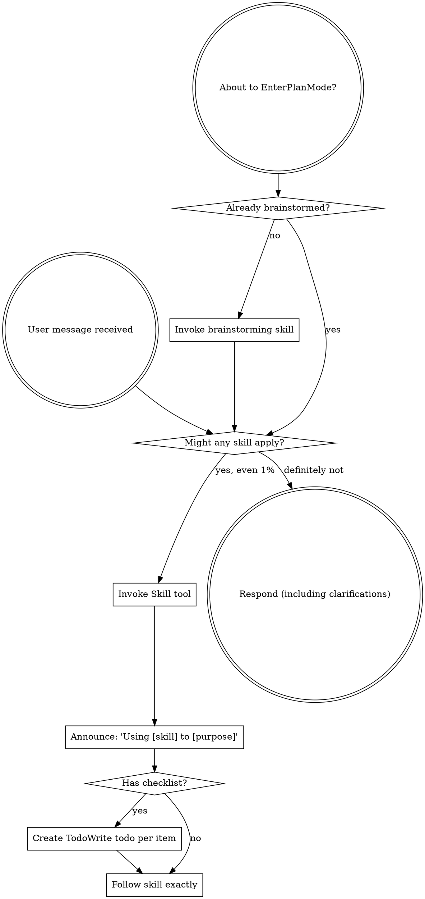

<SUBAGENT-STOP>
If you were dispatched as a subagent to execute a specific task, skip this skill.
</SUBAGENT-STOP>

<EXTREMELY-IMPORTANT>
If you think there is even a 1% chance a skill might apply to what you are doing, you ABSOLUTELY MUST invoke the skill.

IF A SKILL APPLIES TO YOUR TASK, YOU DO NOT HAVE A CHOICE. YOU MUST USE IT.

This is not negotiable. This is not optional. You cannot rationalize your way out of this.
</EXTREMELY-IMPORTANT>

## Personal Fork Defaults

This fork has three standing preferences:

1. Use `superpowers:using-git-branches` for normal development. Do not create or offer git worktrees unless the human partner explicitly asks for a worktree.
2. Keep the main agent's context clean by delegating on the KIND of work, not its size. The criterion is never "how heavy is this task" — task size is irrelevant. The main agent (orchestrator) does coordination only; it dispatches implementation, exploration, and reading of source/task files to fresh subagents (Task tool) and keeps only each subagent's compact result/receipt — never its raw working context, file dumps, or transcript. Each Task subagent returns its result and terminates on its own; for follow-up, dispatch a fresh subagent with the prior result and the exact follow-up scope. Two things follow: (a) a one-line change is still subagent-class work — under `superpowers:subagent-driven-development` it goes to a subagent exactly like a 500-line one, and "small" or "I already have the context" are not exemptions; delegation is what keeps the orchestrator light AND buys independent review, both of which inline forfeits. (b) The ONLY sanctioned ways the orchestrator's own context touches implementation are the two execution skills: `superpowers:subagent-driven-development` (default — dispatch every task to a subagent) and `superpowers:executing-plans` (explicit opt-in — inline-with-checkpoints). Ad-hoc freelance inline implementation outside those two is forbidden. Before your first hand-authored Write/Edit to a source file in an execution phase, you MUST have consciously entered one of those two skills — if you have not, stop and enter one.
3. Do not offer or use the visual companion. Brainstorming is text-only.

## Instruction Priority

Superpowers skills override default system prompt behavior, but **user instructions always take precedence**:

1. **User's explicit instructions** (CLAUDE.md, GEMINI.md, AGENTS.md, direct requests) — highest priority
2. **Superpowers skills** — override default system behavior where they conflict
3. **Default system prompt** — lowest priority

If CLAUDE.md, GEMINI.md, or AGENTS.md says "don't use TDD" and a skill says "always use TDD," follow the user's instructions. The user is in control.

## How to Access Skills

**In Claude Code:** Use the `Skill` tool. When you invoke a skill, its content is loaded and presented to you—follow it directly. Never use the Read tool on skill files.

**In Copilot CLI:** Use the `skill` tool. Skills are auto-discovered from installed plugins. The `skill` tool works the same as Claude Code's `Skill` tool.

**In Gemini CLI:** Skills activate via the `activate_skill` tool. Gemini loads skill metadata at session start and activates the full content on demand.

**In other environments:** Check your platform's documentation for how skills are loaded.

## Platform Adaptation

Skills use Claude Code tool names. Non-CC platforms: see `references/copilot-tools.md` (Copilot CLI), `references/codex-tools.md` (Codex) for tool equivalents. Gemini CLI users get the tool mapping loaded automatically via GEMINI.md.

# Using Skills

## The Rule

**Invoke relevant or requested skills BEFORE any response or action.** Even a 1% chance a skill might apply means that you should invoke the skill to check. If an invoked skill turns out to be wrong for the situation, you don't need to use it.

## Red Flags

These thoughts mean STOP—you're rationalizing:

| Thought | Reality |
|---------|---------|
| "This is just a simple question" | Questions are tasks. Check for skills. |
| "I need more context first" | Skill check comes BEFORE clarifying questions. |
| "Let me explore the codebase first" | Skills tell you HOW to explore. Check first. |
| "I can check git/files quickly" | Files lack conversation context. Check for skills. |
| "Let me gather information first" | Skills tell you HOW to gather information. |
| "This doesn't need a formal skill" | If a skill exists, use it. |
| "I remember this skill" | Skills evolve. Read current version. |
| "This doesn't count as a task" | Action = task. Check for skills. |
| "The skill is overkill" | Simple things become complex. Use it. |
| "I'll just do this one thing first" | Check BEFORE doing anything. |
| "I already have the context, inline is cheaper" | Execution-phase trap. The heavier you are, the MORE you must delegate — that pull is exactly what subagent-driven prevents. Cost is not the axis; dispatch a subagent. |
| "It's just one small function, I'll write it inline" | Size is irrelevant (rule #2). A small change is subagent-class work — dispatch it under subagent-driven, or enter executing-plans on purpose. |
| "The skill check is for the start; I'm mid-execution" | Red flags fire DURING execution too, not only at invocation. A hand-authored Write outside subagent-driven / executing-plans is the violation — stop before it. |
| "This feels productive" | Undisciplined action wastes time. Skills prevent this. |
| "I know what that means" | Knowing the concept ≠ using the skill. Invoke it. |

## Skill Priority

When multiple skills could apply, use this order:

1. **Process skills first** (brainstorming, debugging) - these determine HOW to approach the task
2. **Implementation skills second** (frontend-design, mcp-builder) - these guide execution

"Let's build X" → brainstorming first, then implementation skills.
"Fix this bug" → debugging first, then domain-specific skills.

## Skill Types

**Rigid** (TDD, debugging): Follow exactly. Don't adapt away discipline.

**Flexible** (patterns): Adapt principles to context.

The skill itself tells you which.

## User Instructions

Instructions say WHAT, not HOW. "Add X" or "Fix Y" doesn't mean skip workflows.
